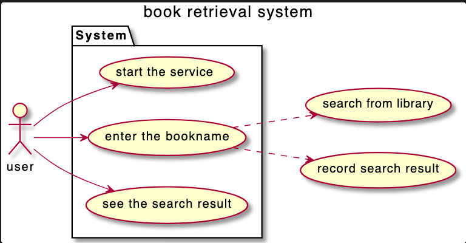

# Shell script Tutorial

## What is this?
This is tutorial of Shell script.

## Use case


## How to use?
clone this, and run ``` $ EXEC_LANG=shell bash scripts/main.sh```  
ex)  
  ```
  $ bash scripts/main.sh
  Please enter book name you want to search.
  Art  (← You type it in command line.)
  Search results are below with search word: Art
  Book name:  The Art of Loving, Area:  A1
  ```

## How to learn?
1. Read the shell scrips, and understand how it works. 
    - main.sh
    - search.sh
2. Translate search.sh to python code.  
   You can just fill the blank in search.py.  
   Try to write python code, and run ``` $ EXEC_LANG=python bash scripts/main.sh```
3. (optional) Save the search result in json file.


## References
- https://www.m3tech.blog/entry/2018/08/21/bash-scripting  
- https://qiita.com/autotaker1984/items/bc758fcf368c1a167353  
- https://www.mtioutput.com/entry/2017/08/11/162306 